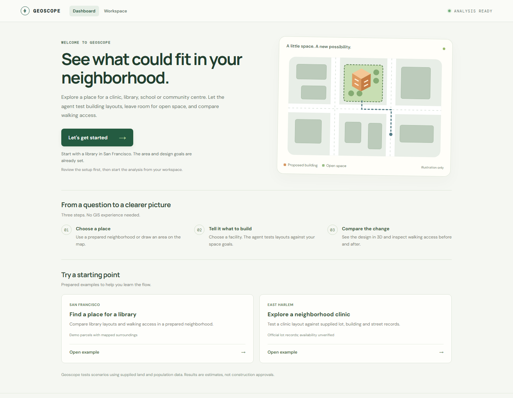

# Geoscope

Explore where a clinic, library, school or community centre could fit. Geoscope uses an agent to test building layouts, check land constraints, and compare walking access before and after a proposal.

[Live demo](http://149.28.204.217/) · [Vultr setup](docs/VULTR_SETUP.md) · [Simulation guide](docs/DESIGN_SIMULATION.md)



## What you can do

- Choose a neighborhood and facility, then set floor-area and open-space goals.
- Compare checked designs on a map and in 3D, with surrounding buildings and streets.
- See existing nearby facilities, population estimates, and before/after walking access.
- Download the analysis code, metrics, map data, and execution trace.

Start with **Let's get started** on the dashboard, review the prepared example, and select **Design & compare**.

## Run locally

Requires **Python 3.12+** and **Node.js 24**. From the repository root in PowerShell:

```powershell
python -m venv .venv
.\.venv\Scripts\python.exe -m pip install -r requirements-test.txt
npm --prefix web ci
npm --prefix web run build
.\.venv\Scripts\python.exe -m verification.scenario_demo_server --port 8765
```

Open **http://127.0.0.1:8765**. On macOS/Linux, use `.venv/bin/python` instead of `.\.venv\Scripts\python.exe`. Stop the server with **Ctrl+C**.

This local preview uses fixed calculations without an LLM or cloud sandbox. For agent execution on Vultr, follow the [deployment guide](docs/VULTR_SETUP.md).

## How it works

**React + Leaflet + Three.js** provide the interface. A **FastAPI controller on Vultr** calls **Vultr Serverless Inference** and dispatches generated Python to a separate worker over a private VPC.

The worker executes code in disposable **gVisor containers**, with no outbound network, read-only inputs, and resource limits. A fresh sandbox recomputes submitted designs before their results are displayed.

## Data and limits

The SF demo combines Census and OpenStreetMap data with **simulated candidate plots**. East Harlem uses official lot, building and street records. Geometric fit does not establish land availability or construction approval; population and walking results are estimates.

## Documentation

- [Simulation details and API](docs/DESIGN_SIMULATION.md)
- [Development commands and operations](docs/HANDOFF.md)
- [Deployment troubleshooting](docs/VULTR_ADVANCED.md)
- Data sources: [San Francisco](data/real-scenario/README.md), [East Harlem](data/real-nyc-land/README.md), [walking networks](data/walk/README.md)
